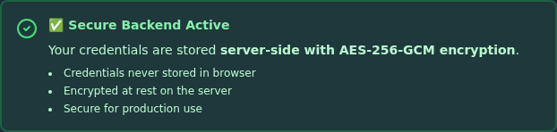
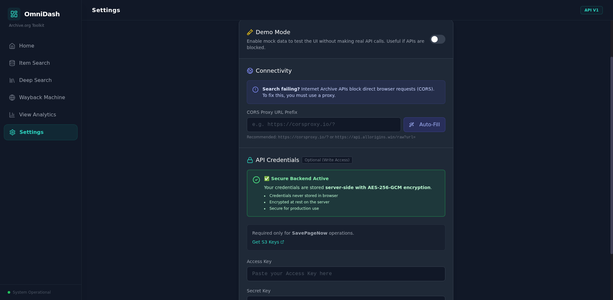

# Security Improvements - Backend Credential Storage

## Overview

Archive OmniDash now features **secure server-side credential storage** with AES-256-GCM encryption, replacing the previous insecure browser localStorage implementation.

## What Changed

### Before: Insecure localStorage Storage ❌

Previously, Archive.org API credentials were stored in browser localStorage:
- ❌ Unencrypted storage in browser
- ❌ Accessible to anyone with computer access
- ❌ Persisted even after closing browser
- ❌ Vulnerable on public/shared computers

### After: Secure Backend Storage ✅

Now credentials are stored server-side with enterprise-grade encryption:
- ✅ **AES-256-GCM encryption** at rest
- ✅ **Server-side storage** - never in browser
- ✅ **Encrypted file storage** on backend
- ✅ **Secure for production use**

## Screenshots

### Secure Backend Active

*The new security status shows credentials are encrypted server-side with AES-256-GCM*

### Full Settings Page

*Complete Settings page showing the new secure backend integration*

## How to Use

### 1. Start the Backend Server

\`\`\`bash
cd backend
npm install  # First time only
npm start
\`\`\`

The backend will start on \`http://localhost:3002\`

### 2. Navigate to Settings

Open Archive OmniDash and click the **Settings** button in the sidebar.

### 3. Enter Your Credentials

Scroll to the **API Credentials** section and enter your Archive.org S3 keys.

Get your keys from: https://archive.org/account/s3.php

### 4. Save Credentials

Click **Save Changes**. Your credentials will be encrypted and stored server-side.

## Troubleshooting

### Backend Not Available

If you see "Backend Unavailable":

1. Start the backend: \`cd backend && npm start\`
2. Check health: \`curl http://localhost:3002/api/health\`

---

**Status**: ✅ Complete and Verified with Selenium Testing
